# Architecture and reading path

Gleam MCP puts a typed tool contract between application values and protocol
bytes. The same definition supplies client argument encoding, server argument
decoding, server output encoding, and client output decoding. The transport
owns resource lifetime; the application owns the tool's external effects.

Start with [tool](../src/gleam_mcp/tool.gleam),
[codec](../src/gleam_mcp/codec.gleam), and
[request](../src/gleam_mcp/request.gleam). Then follow a call through
[client](../src/gleam_mcp/client.gleam) and its matching handler through
[server](../src/gleam_mcp/server.gleam). Their module `Flow` sections name the
functions in execution order. For transport work, read the selected stdio or
HTTP path below. For validator work, read the schema path last, after the
contract it protects is clear.

[Protocol contracts](protocol.md) record wire profiles, exact upstream pins
and compatibility limits. [Principles](principles.md) explain the design and
comment conventions. [Execution](execution.md) describes the local gates;
[the handoff](next.md) records previous verification and remaining work.

## A typed call

`schema.new` compiles an offline structural contract. `codec.new` couples
that schema to `fn(a) -> JsonValue` and `fn(JsonValue) -> Result(a, String)`.
`tool.new` ties the argument and output codecs to one validated wire name.
The `Tool(args, output)` type parameters make a mismatched call a compiler
error. The opaque constructor keeps consumers from replacing a codec or
bypassing name admission.

A schema check and a domain check answer different questions. A string schema
can establish that an answer is text. A decoder closed over the original
arguments can establish that the text is one of *this request's* allowed
labels. `tool.result_codec` makes that closure before `client.call` enters
the transport. `server.bind_round_trip` uses the same request-bound decoder
on a successful encoded handler result before returning it.

```mermaid
flowchart LR
  A[Typed arguments] --> B[tool.encode_arguments]
  B --> C[codec.encode: emitted JSON schema check]
  C --> D[request.Endpoint: transport admission and exchange]
  D --> E[server: envelope and profile admission]
  E --> F[tool.decode_arguments: schema then domain]
  F --> G[Application handler]
  G --> H[Output encoder, schema and request-bound decoder]
  H --> I[Correlated response]
  I --> J[Client output schema and request-bound decoder]
  J --> K[Typed output]
```

A custom encoder still undergoes a schema check after emitting JSON. A custom
decoder runs after schema admission. Gleam cannot establish that these
callbacks terminate, avoid effects, or invert each other; application authors
supply those properties. Raw `server.tool` registration has a narrower
contract: it checks root schema shape, and its handler owns domain decoding.
Modern dispatch additionally compiles and validates its input schema. The raw
legacy call path doesn't gain the typed wrapper's checks.

`request.Endpoint` stores the exchange callback and schema admission policy.
It creates no process or socket. The built-in HTTP endpoint installs header
plan admission; a custom endpoint must enforce its own deadline and resource
cleanup. Holding an `Outbound.timeout_ms` value alone cannot stop work.

## Completion, suspension and subscriptions

`client.call` returns a typed `Complete`, a visible `ToolFailed`, or
`InputRequired`. A tool failure has `isError` and doesn't have to satisfy the
successful output schema. A protocol error, transport failure or invalid
response stays in the `Result` error channel.

An `input_required` result ends one attempt. The opaque `Continuation` retains
the exact endpoint, encoded arguments, input schema, output decoder, revision
and latest [MRTR suspension](../src/gleam_mcp/mrtr.gleam).
`mrtr.responses` checks exact input keys and object values. `client.resume`
checks those keys again against the retained suspension, preserves the
revision, and issues a fresh explicit request. It doesn't replay an interrupted
effect. Server `requestState` remains untrusted bytes; a handler that uses it
for authority must validate integrity and freshness itself.

A [subscription Stream](../src/gleam_mcp/subscription.gleam) first requires
an acknowledgement with the same id and an accepted subset of the requested
sources. Only that subset can reach the observer. A successful complete result
also requires acknowledgement and matching identity. The immutable server
catalog accepts an empty subset because it has no change producer. An empty
subset still owns a live request until completion, cancellation or disconnect.

The native client allocates a peer id distinct from the caller-visible id.
It validates incoming stream metadata against the peer id, then rewrites the
admitted event for the caller. The two ids remain paired in the pending request
record until retirement. HTTP uses a request-owned connection, so its policy
can validate the original id directly.

## Native stdio ownership

[transport](../src/gleam_mcp/transport.gleam) describes the future child rather
than passing an already-open port into the client. The actor opens the port
itself and receives its events. `prepare` starts that owner parked; the host
can publish custody before `connect` or `connect_modern` opens native work.
Legacy `connect` additionally performs initialization. Modern startup carries
metadata on each request and sends no initialize exchange.

The actor repairs a split UTF-8 prefix, frames complete lines with
[stdio](../src/gleam_mcp/stdio.gleam), and decodes them with
[jsonrpc](../src/gleam_mcp/jsonrpc.gleam). Invalid bytes, oversized lines and
malformed envelopes close the channel. Unknown response ids are dropped.
Expiry removes the pending id, so a late result can't settle another call.
Modern requests also monitor the caller; losing it initiates cancellation.

Shutdown settles pending calls and requests direct-child termination. It
retains the port until native `exit_status`, then holds that evidence for the
custodian. `client.shutdown` requires both the evidence and the original
actor's normal DOWN. A timeout or abnormal owner death reports uncertainty.
The current PID lookup and SIGKILL policy doesn't atomically signal a child,
join descendants, or reverse remote effects. The host owns executable selection
and isolation; the SDK doesn't create a jail.

[server_stdio](../src/gleam_mcp/server_stdio.gleam) owns input, output and
admitted handler scopes. Legacy dispatch stays ordered beside one lookahead
read. Modern dispatch uses a parked coordinator, a gated reader, one writer,
and at most eight witnessed handler scopes. A handler parks before executing
until its scope is retained. It also parks after submitting its answer; normal
scope exit authorizes the coordinator to publish that answer.

EOF stops new admission and drains callbacks under their existing deadlines.
Read or write failure requests cancellation while retaining scope handles until
exit. Writer backpressure parks the reader when its queued count reaches 128.
Control traffic shares the coordinator rather than waiting behind a blocked
tool callback. Joining a worker proves local termination; the application owns
any cleanup required by its external effects.

## HTTP ownership

[client_http](../src/gleam_mcp/client_http.gleam) derives standard metadata
mirrors from the exact envelope. [http_headers](../src/gleam_mcp/http_headers.gleam)
compiles custom `x-mcp-header` annotations into unique names and statically
reachable primitive property paths. These checks finish before opening Gun.
The managed request task adopts Gun's pid before the first POST; retries are
disabled. TLS verifies the peer and hostname.

Request expiry and resource retirement have separate clocks: joining Gun can
continue beyond the original response deadline. Gun parses HTTP and provides
flow-controlled fragments. The SDK checks byte
caps before retaining a JSON body and renews credit after consumption. For SSE,
[sse](../src/gleam_mcp/sse.gleam) retains bytes until a complete UTF-8 line,
collects data fields, and emits at a blank line. Notifications and final
responses pass correlation and subscription policy before delivery. A lost
final response leaves the execution outcome unknown. `listen`, `poll` and
`cancel` retain and drain one subscription scope with its own socket.

[server_http](../src/gleam_mcp/server_http.gleam) binds loopback and requires an
explicit operator admission policy. Every present Origin must match the
allowlist before routing or authentication. Body collection admits only
unambiguous Content-Length framing within eight MiB; Transfer-Encoding is
refused before Mist can buffer a declared chunk. Standard and custom mirrors
validate before a socket stream can start the handler.

Mist transfers the socket to a parked SSE actor. Only after that transfer does
`Start` admit the weft scope. Socket close or failed output cancels the scope;
the normal drain path waits for `AllDelivered` before stopping. `RunLost`
closes after scope loss and isn't a normal drain proof. Mist and Glisten pins
register factories before admission and retire them after admission stops.
The native adapters translate calls and exact socket messages; Gleam owns
policy, selection and lifetime.

Rejected bounded bodies are drained without JSON parsing before keepalive
reuse. The shared refusal budget is fifteen seconds plus at most one blocking
native read. Admitted body reads have a byte cap but no aggregate wall-clock
deadline in this layer. Operator authentication, browser Origin validation and
tool authorization remain separate checks.

## Offline schema evaluation

[schema](../src/gleam_mcp/schema.gleam) is the opaque public entry point.
[document](../src/gleam_mcp/internal/schema/document.gleam) checks input weight,
keyword shapes and enabled vocabularies, then indexes resource ids and anchors.
References resolve only against supplied offline resources. Unknown annotations
remain data until an explicit reference makes their value a schema target.
Locations are indexed once, so a cyclic reference graph doesn't force an
unbounded compilation traversal.

[evaluate](../src/gleam_mcp/internal/schema/evaluate.gleam) carries three things:
the instance path, a shared remaining work allowance, and successful coverage
of names or indices at that instance location. Applicators on the same instance
can merge coverage. Validating a child records the parent's member, rather than
importing the child's nested coverage. `unevaluatedProperties` and
`unevaluatedItems` run after adjacent applicators.

A failed branch discards its coverage but keeps its work charge. Exhaustion
propagates as `Limit`; it cannot count as a mismatch that makes `not` or an
alternative succeed. [number](../src/gleam_mcp/internal/schema/number.gleam)
compares decimal ratios, while [value](../src/gleam_mcp/internal/schema/value.gleam)
handles structural equality. [pattern](../src/gleam_mcp/internal/schema/pattern.gleam)
translates a supported ECMAScript/PCRE2 subset and refuses unsupported syntax.
The logical allowance doesn't time-bound a native regex match. Float rendering
also can't recover precision already lost at JSON parsing.

## Enforced limits and their scope

| Boundary | Source limit | What the limit establishes |
| --- | --- | --- |
| JSON parsing | 256 container levels | Refusal before deeper parser recursion. |
| Stdio framing | 16 MiB per line | Bounded complete or pending message. |
| Native UTF-8 repair | Three held bytes | Only a plausible incomplete code point is retained. |
| Modern native client | 128 pending requests | Pending-request admission ceiling. |
| Tools pagination | 64 pages | Finite traversal; modern pages share one deadline, legacy pages each use a budget. |
| MRTR input maps | 32 unique keys | Finite request/response key admission. |
| Modern stdio server | Eight handlers; reader gating at 128 queued writes | Bounded admitted callback concurrency and output backpressure. |
| Server registry | 32 subscription ids | Admission ceiling on one retained registry, not aggregate HTTP streams. |
| HTTP body or event | Eight MiB | One collected JSON body, request body or SSE event; no aggregate subscription byte ceiling. |
| Schema compilation | 10,000 schema-node visits; 128 depth | Logical compilation allowance and recursion bound. |
| Schema input and evaluation | 100,000 weighted units; 128 depth | Per-input admission and shared evaluation allowance. |

These local bounds don't establish an aggregate heap, CPU or lifetime budget
for every use of the SDK. Direct `JsonValue` constructors and caller callbacks
remain application responsibilities. See the [corpus record](../test/fixtures/json_schema/UPSTREAM.md)
for required coverage, optional mismatches, regex forms and exact suite pins.
Resources, prompts, optional providers, OAuth flows and tasks remain outside
the advertised tools scope; [extensions](extensions.md) records that boundary.
